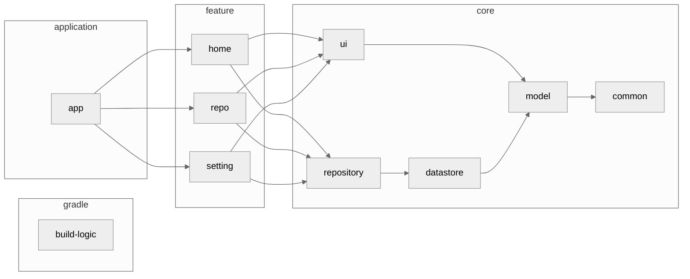

<h1 align="center">yumemi-codecheck</h1>

<p align="center">
GitHub リポジトリ検索アプリ<br>
yumemi-codecheck は 株式会社ゆめみ様の Android エンジニア用コードチェック課題の提出用リポジトリです。
</p>

<div align="center">
  <a href="./LICENSE">
    
  </a>
  <a href="">
    
  </a>
  <a href="https://open.vscode.dev/matsumo0922/yumemi-codecheck">
    
  </a>
</div>

<hr>

<p align="center">
    
</p>


## Status
#### Ready!! :rocket:

GitHub リリースにて最新のコードおよび APK を配布しています。
また、モバイルアプリ開発者の方はアプリをビルドして、自分でインストールすることもできます。
本アプリは株式会社ゆめみ様の[Androidエンジニア用コードチェック課題](https://github.com/yumemi-inc/android-engineer-codecheck)を元に開発されており、元リポジトリも併せてご覧ください。

#### [Download](https://github.com/matsumo0922/yumemi-codecheck/releases) from GitHub

## Tech Stack

- [Kotlin](https://kotlinlang.org/)
- [Kotlin Coroutines](https://kotlinlang.org/docs/coroutines-overview.html)
- [Kotlin Flow](https://kotlinlang.org/docs/flow.html)
- [Kotlin Multiplatform](https://www.jetbrains.com/ja-jp/kotlin-multiplatform/)
- [Jetpack Compose](https://developer.android.com/jetpack/compose?hl=ja)
- [Jetpack Compose Multiplatform](https://www.jetbrains.com/ja-jp/lp/compose-multiplatform/)
- [Material3](https://m3.material.io)

## Environment

- IDE: Android Studio Iguana | 2023.2.1 Patch 1
- Kotlin: 2.0.0-RC03
- Java: 17
- Gradle: 8.3.2
- minSdk: 23
- targetSdk: 34
- compileSdk: 34

## Feature
#### Ready!!

- リポジトリ
  - リポジトリの検索 (`search/repositories`)
  - リポジトリの詳細表示 (`repos/:owner/:repo`)
  - お気に入り機能
- トレンド
  - Weekly のトレンドリポジトリを表示 ([`alisoft/github-trending-api`](https://github.com/alisoft/github-trending-api))
  - トレンドリポジトリの詳細
  - トレンドリポジトリのお気に入り機能
- UI/UX
  - ライトモード / ダークモード
  - ローカライズ（日本語 / 英語）
  - テーマカラーの変更
  - フォントサイズの変更
  - ダイナミックカラーの対応 (Android 12 以上)

#### Not Ready...

- リポジトリ
  - 詳細検索
  - 検索結果のソートおよびフィルター
  - issue の表示
  - PR の表示
  - ReadMe の適切な表示
- KMP
  - compose-multiplatform を用いた iOS および Desktop への展開

## Architecture

アプリのアーキテクチャ図を示します。 基本的には MVVM + Repository パターンを採用していますが、一部異なる箇所があります。
また、実際はモジュール分割されていませんが、他パッケージとの結合はなく各機能は疎結合です。モジュール分割予定のissueについては #23 をご覧ください。



## Contribute

このアプリは Gradle の Convention Plugins を用いてビルドのロジックを共通化しており、`build-logic` というモジュールに全てのロジックが記述されています。このアプローチに関しては、[nowinandroid](https://github.com/matsumo0922/nowinandroid/tree/main/build-logic) をご覧ください。
このアプリは株式会社ゆめみ様のAndroidエンジニア用コードチェック課題であるため、コントリビュートは基本的に受け付けておりません。ただし、バグ報告や機能追加の提案は歓迎いたしますので、Issue を作成してください。


## License

```text
yumemi-codecheck
Copyright (C) 2024 daichi-matsumoto

This program is free software: you can redistribute it and/or modify
it under the terms of the GNU General Public License as published by
the Free Software Foundation, either version 3 of the License, or
(at your option) any later version.

This program is distributed in the hope that it will be useful,
but WITHOUT ANY WARRANTY; without even the implied warranty of
MERCHANTABILITY or FITNESS FOR A PARTICULAR PURPOSE.  See the
GNU General Public License for more details.

You should have received a copy of the GNU General Public License
along with this program.  If not, see <https://www.gnu.org/licenses/>.

Also you can contact me by electronic mail at caios.system@gmail.com.

If the program does terminal interaction, make it output a short
notice like this when it starts in an interactive mode:

    yumemi-codecheck  Copyright (C) 2024 daichi-matsumoto
    This program comes with ABSOLUTELY NO WARRANTY; for details type `show w'.
    This is free software, and you are welcome to redistribute it
    under certain conditions; type `show c' for details.

The hypothetical commands `show w' and `show c' should show the appropriate
parts of the General Public License.  Of course, your program's commands
might be different; for a GUI interface, you would use an "about box".

You should also get your employer (if you work as a programmer) or school,
if any, to sign a "copyright disclaimer" for the program, if necessary.
For more information on this, and how to apply and follow the GNU GPL, see
<https://www.gnu.org/licenses/>.

The GNU General Public License does not permit incorporating your program
into proprietary programs.  If your program is a subroutine library, you
may consider it more useful to permit linking proprietary applications with
the library.  If this is what you want to do, use the GNU Lesser General
Public License instead of this License.  But first, please read
<https://www.gnu.org/licenses/why-not-lgpl.html>.
```

<details>
<summary>オリジナル ReadMe (yumemi-android-engineer-code-check)</summary>
# 株式会社ゆめみ Android エンジニアコードチェック課題

## 概要

本プロジェクトは株式会社ゆめみ（以下弊社）が、弊社に Android エンジニアを希望する方に出す課題のベースプロジェクトです。本課題が与えられた方は、下記の概要を詳しく読んだ上で課題を取り組んでください。

## アプリ仕様

本アプリは GitHub のリポジトリを検索するアプリです。


### 環境

- IDE：Android Studio Flamingo | 2022.2.1 Patch 2
- Kotlin：1.6.21
- Java：17
- Gradle：8.0
- minSdk：23
- targetSdk：31

※ ライブラリの利用はオープンソースのものに限ります。
※ 環境は適宜更新してください。

### 動作

1. 何かしらのキーワードを入力
2. GitHub API（`search/repositories`）でリポジトリを検索し、結果一覧を概要（リポジトリ名）で表示
3. 特定の結果を選択したら、該当リポジトリの詳細（リポジトリ名、オーナーアイコン、プロジェクト言語、Star 数、Watcher 数、Fork 数、Issue 数）を表示

## 課題取り組み方法

Issues を確認した上、本プロジェクトを [**Duplicate** してください](https://help.github.com/en/github/creating-cloning-and-archiving-repositories/duplicating-a-repository)（Fork しないようにしてください。必要ならプライベートリポジトリにしても大丈夫です）。今後のコミットは全てご自身のリポジトリで行ってください。

コードチェックの課題 Issue は全て [`課題`](https://github.com/yumemi-inc/android-engineer-codecheck/milestone/1) Milestone がついており、難易度に応じて Label が [`初級`](https://github.com/yumemi-inc/android-engineer-codecheck/issues?q=is%3Aopen+is%3Aissue+label%3A初級+milestone%3A課題)、[`中級`](https://github.com/yumemi-inc/android-engineer-codecheck/issues?q=is%3Aopen+is%3Aissue+label%3A中級+milestone%3A課題+) と [`ボーナス`](https://github.com/yumemi-inc/android-engineer-codecheck/issues?q=is%3Aopen+is%3Aissue+label%3Aボーナス+milestone%3A課題+) に分けられています。課題の必須／選択は下記の表とします。

|   | 初級 | 中級 | ボーナス
|--:|:--:|:--:|:--:|
| 新卒／未経験者 | 必須 | 選択 | 選択 |
| 中途／経験者 | 必須 | 必須 | 選択 |

課題 Issueをご自身のリポジトリーにコピーするGitHub Actionsをご用意しております。  
[こちらのWorkflow](./.github/workflows/copy-issues.yml)を[手動でトリガーする](https://docs.github.com/ja/actions/managing-workflow-runs/manually-running-a-workflow)ことでコピーできますのでご活用下さい。

課題が完成したら、リポジトリのアドレスを教えてください。

## 参考記事

提出された課題の評価ポイントに関しては、[こちらの記事](https://qiita.com/blendthink/items/aa70b8b3106fb4e3555f)に詳しく書かれてありますので、ぜひご覧ください。

## AIサービスの利用について

ChatGPTなどAIサービスの利用は禁止しておりません。

利用にあたって工夫したプロンプトやソースコメント等をご提出頂くことで、加点評価する場合もございます。 (減点評価はありません)

また、弊社コードチェック担当者もAIサービスを利用させていただく場合があります。

AIサービスの利用は差し控えてもらいたいなどのご要望がある場合は、お気軽にお申し出ください。
</details>
